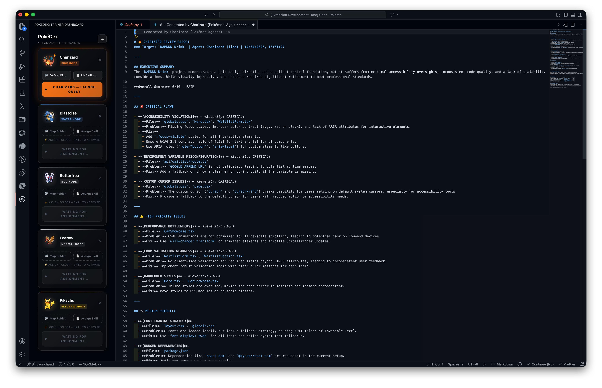

# 🔴 PokéDex — AI Sub-Agent Trainer

[](https://github.com/your-username/pokedex-extension)

**PokéDex** is a high-performance VS Code extension that turns your codebase into a training ground for Pokémon Sub-Agents. Recruit agents, assign them "Skill Manuals," and launch them on **Review Quests** to perform brutally honest architectural analysis.

---

## 📸 Preview


---

## 🔥 Key Features

### 🏢 Trainer Dashboard
A premium, glassmorphism-inspired UI for managing your Squad. Track assigned folders and skill manuals in real-time.

### 📜 Review Quests
Launch a review on any local folder. Your assigned agent will:
1. **Recursively Scan** your code.
2. **Consult its Skill Manual** (custom `.md` instructions).
3. **Generate a PRD Report** via GitHub Copilot (or clipboard) with:
   - 🚨 **Critical Flaws**
   - ⚠️ **High Priority Issues**
   - 📋 **Actionable Roadmap**

### 📔 The PokéDex Menu
Recruit Generation 1-4 Pokémon as your sub-agents. Each comes with a unique "Type" and aesthetic glow.

---

## 🛠️ How to Install

### From VSIX (Easiest)
1. Download the latest `pokedex-x.x.x.vsix` from the [Releases](https://github.com/your-username/pokedex-extension/releases) page.
2. Open VS Code.
3. Go to the Extensions view (`Cmd+Shift+X`).
4. Click the "..." menu in the top right and select **Install from VSIX...**
5. Select the downloaded file.

### From Source
1. Clone the repo:
   ```bash
   git clone https://github.com/your-username/pokedex-extension.git
   ```
2. Build the entire project in one click:
   ```bash
   npm run build:all
   ```
3. Press `F5` to launch the extension in debug mode.

---

## 💿 Skill Manuals (TMs)
You can teach your agents any specialty by assigning them a `.md` or `.txt` file. 
- Assignments can range from "Senior Security Audit" to "Frontend Performance Ninja."

---

## ⚖️ License
This project is licensed under the **Professor Oak Public License (POPL)** — see the [LICENSE](LICENSE.md) file for more Poké-nerdy details.

---

*Built with ❤️ by Trainer **Antigravity** & **Aripreets***
